## Part 1. nginx

#### Take the official docker image **nginx**.

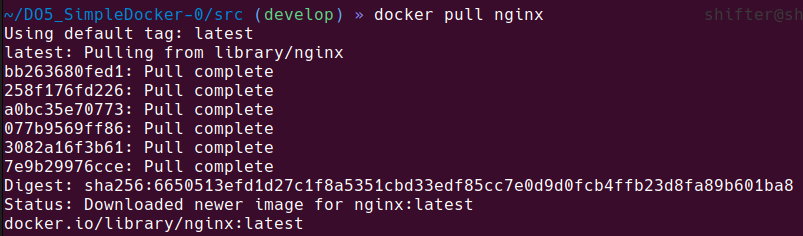 

#### Check images.

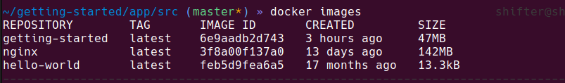 

#### Check running proccess.

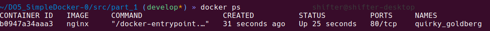 

- Container size: "ShmSize": 67108864 (67 Mb)
- Mapped Port -80(not bound) None. 
- Container IPAddress: "172.17.0.2",

#### Stop current nginx

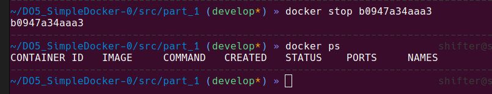 

#### Start with ports 80 and 453.
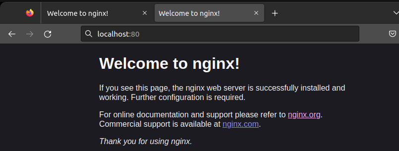

#### Restart and still working.
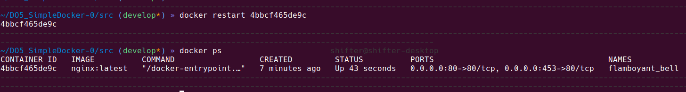

## Part 2. Operation with container.

#### nginx.conf inside container
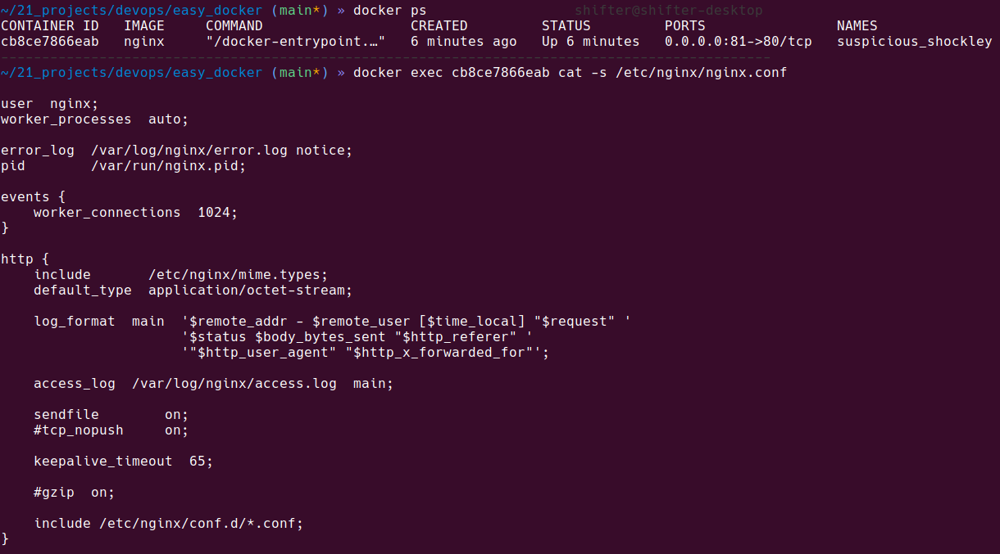

#### Shown status nginx page
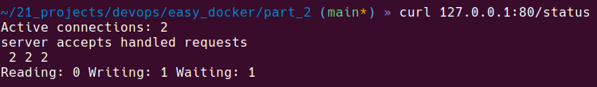

#### Export container
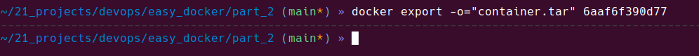

#### Import and run container
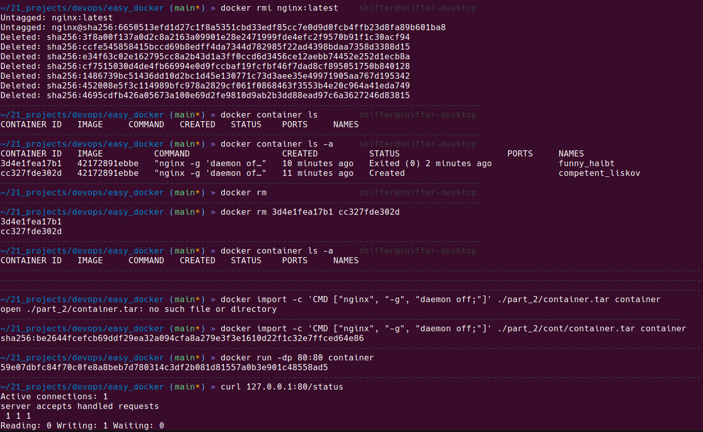

## Part 3. Mini web server.

#### Write hello world page and spawn fcgi on 8080 port
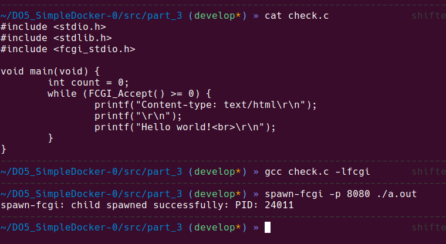

#### Nginx configure
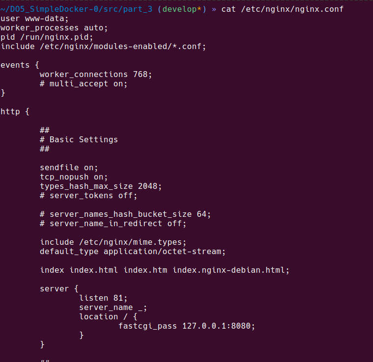

#### Get Hello World Page
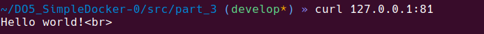

## Part 4. Own docker.

#### Build image and spawn on 81 ports.
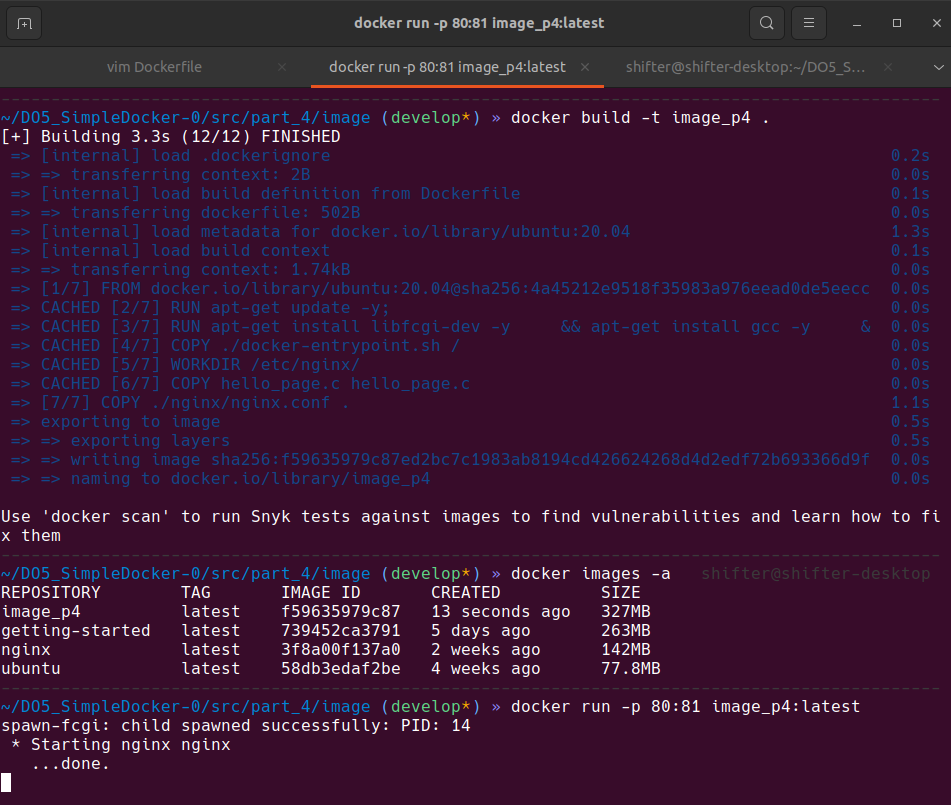

#### Curl from localhost and nginx conf.
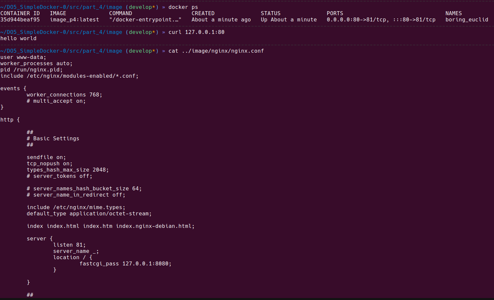

#### Local nginx conf.

#### Run with mount new nginx conf.

#### Get status page.
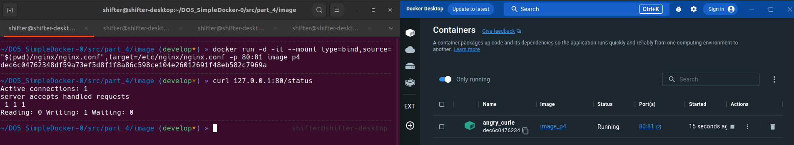
