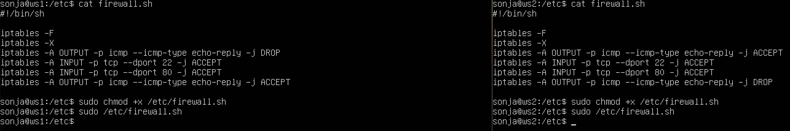
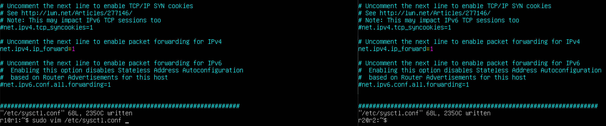
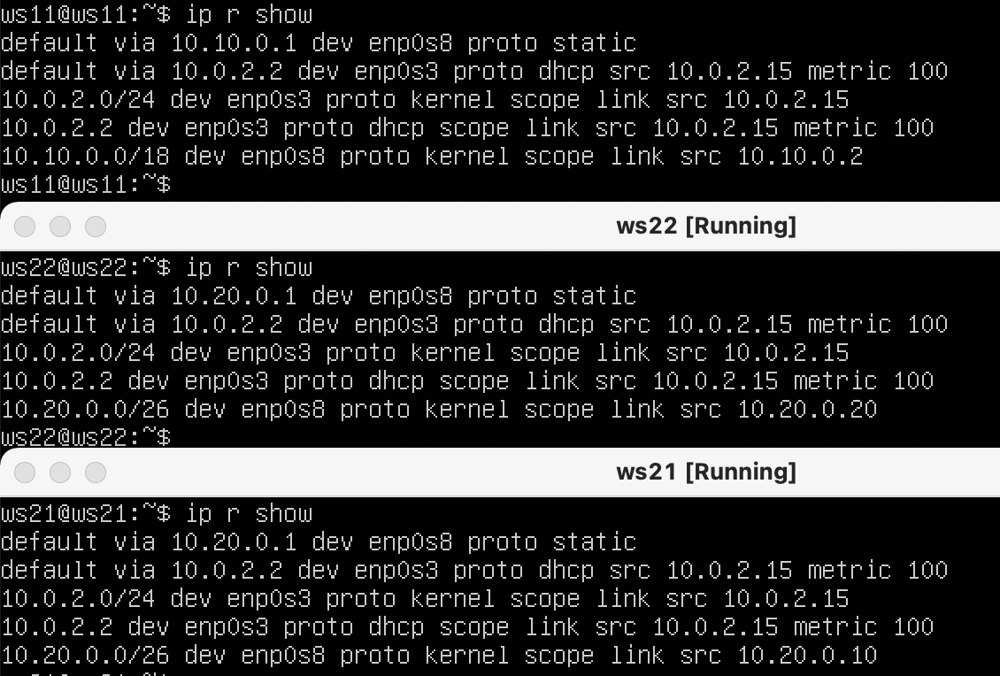
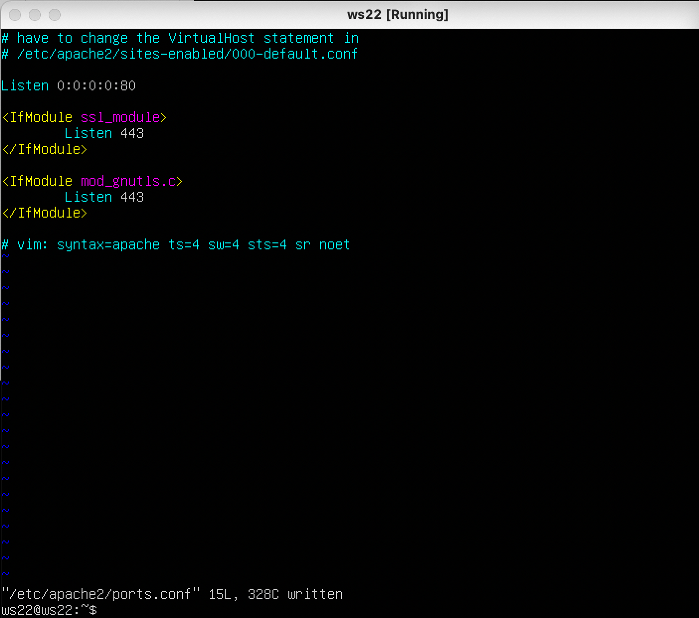

## Part 1. IPcalc tool
### 1.1 Networks and Masks
#### Network address 192.167.38.54/13
  

  - Mask ```255.255.255.0``` in prefix notation is ```/24```, binary ```1111111.1111111.1111111.00000000```
  - Mask ```/15``` in common ```255.254.0.0```, in binary ```11111111.11111110.00000000.00000000```
  - Mask  ```11111111.11111111.11111111.11110000``` in common ```255.255.255.240```, in prefix ```/28```

#### Network address 12.167.38.4
  - Mask /8  : min_host 12.0.0.1 max_host 12.255.255.254
  - Mask 11111111.11111111.00000000.00000000 min_host 12.167.0.1 max_host 12.167.255.254 
  - Mask 255.255.254.0 min_host 12.167.38.1 max_host 12.167.39.254


### 1.2 localhost
#### Local host can be defined from 127.0.0.1 to 127.255.255.254:
    194.34.23.100 -
    128.0.0.1 -
    127.0.0.2 +
    127.1.0.1 +


### 1.3 Network ranges and segments
#### Public IP:
    134.43.0.2
    172.0.2.1
    192.172.0.1
    172.68.0.2
    192.169.168.1
#### Private IP:
    10.0.0.45
    192.168.4.2
    172.20.250.4
    172.16.255.255
    10.10.10.10

For network ```10.10.0.0/18``` are possible next gateway
  - 10.10.0.2
  - 10.10.10.10
  - 10.10.1.255


## Part 2. Static routing between two machines.

  > WS1, WS2 shows the same.
  

  Internal network defines with mask /24, it's *10.0.2*.
  
  > Configuration for ws1 and ws2
  
  

  > Add a static route for both machines
  

  > Ping the conections between the machines
  

  > New static conf
  

  > Ping with static conf
  


## Part 3. Iperf3
### 3.1 Connection speed.
#### Conversion result:
  - 8 Mbps = 1 MB/s
  - 100 MB/s = 100 000 Kbps
  - 1 Gbps = 1000 Mbps

  > Speed between machines
  


## Part 4. Network firewall
### Iptables tool
  Add a new rules for ws1 and ws2:
  - in the first case we deny all traphics, turn on ssh and http ports, after that, we accepted trafic
  - second case: we have inverse (first accept, after deny)
  
  
### Nmap tool
  We can see for trouble with ping for one side, because we have deny rules for ws2 (DROP's last rule)
  

   


## Part 5. Static network routing
### 5.1 Configuration of machine addresses
  

#### Ping ws21->ws22
  

#### Ping r1->ws21
  

### 5.2 Enabling IP forwarding
#### Ip forward for current session 
  

#### Static IP forward conf 
  

### 5.3 Default route configuration
#### For machines
  

#### IP r show
  

#### Ping r2 from ws11, and catch package with tcpdump
  

### 5.4 Adding static routes
#### Static routes for routers
   
  
#### Ip r for routers
  

#### Ip list
    

  The IP address **0.0.0.0** is a non-routable IPv4 address that can be used for various purposes, mainly as a default or placeholder address.


### 5.5 Making a router list


#### Traceroute from ws11 to ws22 
  
  For define intemediate routers traceroute sends 3 (default) ICPM package 


#### 5.6. Using **ICMP** protocol in routing

  
  

## Part 6. Dynamic IP configuration using **DHCP**

  **Specify the default router address, DNS-server and internal network address.**
   

  **Restart dhcp servers**

  

  **New conf with static dhcp**
  

  **Ping from ws22 to ws21**
  

  **Specify MAC address at ws11**  
  

  **DHCP conf for r1 with static MAC address, and new ip for ws11**
  


## Part 7. [DS]NAT

* **Establish connection with dnat and snat**
* First install `apache2` and change cobfig file to open port
* 
* 
* 
* 
* 
* Change rules to accept IMCP protocol packets
* 
* 
* 
* 
<br>

## Part 8. SSH tunnels

* **Connect one machine to other via ssh**
* `ssh -R <host port>:<network>:<reciving port(from apache2)> <login>@<address>` - Local TCP forwarding
* `ssh -L <host port>:<network>:<reciving port(from apache2)> <login>@<address>` - Remote TCP forwarding
* 
* 
* 
* 
* 
<br>
